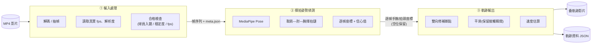

# SwingTrace

> Tennis swing-motion analysis from video. Extracts wrist/racket-head trajectories via pose estimation to visualize and measure your strokes.

從一支上傳的網球影片中,擷取**揮拍動作的軌跡**(手腕 / 拍頭路徑),把你的正手、反拍、發球畫出來、量出來。定位是**賽後離線分析**:上傳影片 → 背景處理 → 拿到一支疊上軌跡的影片與數據,而非即時。

---

## 這是什麼

SwingTrace 用**姿態估計**(而非追球)抓出揮拍者手臂的逐幀位置,串成一條乾淨連續的揮拍軌跡,再疊回原影片並算出揮拍速度等數據。整個流程拆成三個獨立、好除錯的模組,串接靠固定的資料契約,任一模組改邏輯都不必整條重跑。

適合:想看清自己揮拍動作、比較多次揮拍一致性、量化揮拍速度與動作範圍的球員或教練。

---

## 運作流程



**資料契約(模組間的接口)**

| 階段 | 輸入 | 輸出 |
|------|------|------|
| ① 輸入處理 | MP4 | 標準化幀序列 + `meta.json`(`fps_real`、`stroke_type`、`dominant_hand`、`two_handed_backhand`、checks) |
| ② 姿勢偵測 | 幀序列 + meta | 逐幀手腕/拍頭座標 + 信心值(低信心/遮擋幀保留並標記) |
| ③ 軌跡輸出 | 逐幀座標 | 疊軌跡影片 + 軌跡 JSON(座標、速度、修補/外推標記) |

---

## 三個模組

| 模組 | 職責 | 核心技術 | 規格 |
|------|------|----------|------|
| **① 輸入處理** | 把來路不明的 MP4 變成乾淨、帶完整中繼資料的幀序列,並在源頭擋掉不能分析的影片 | ffmpeg / ffprobe | [`01-input-mp4/SKILL.md`](01-input-mp4/SKILL.md) |
| **② 揮拍姿勢偵測** | 逐幀抓揮拍者的肩—肘—腕,手腕(或外推拍頭)位置即揮拍軌跡 | MediaPipe Pose | [`02-model-pose/SKILL.md`](02-model-pose/SKILL.md) |
| **③ 軌跡輸出** | 串接、雙向修補、平滑,疊回影片並算速度 | 軌跡最佳化 / 視覺化 | [`03-output-trajectory/SKILL.md`](03-output-trajectory/SKILL.md) |

每個模組的 `SKILL.md` 都寫了該模組的做法、決策與**最容易踩的雷**(模組一:VFR 不能假設等間距時間;模組二:發球撓背的自我遮擋要保留別丟;模組三:揮拍是人體弧線,別套球的彈道平滑)。

---

## 專案結構

```
swingtrace/
├── README.md
├── 01-input-mp4/
│   └── SKILL.md          # 模組一規格:MP4 解碼、抽幀、合格檢查、meta 輸出
├── 02-model-pose/
│   └── SKILL.md          # 模組二規格:姿態估計、取關節、逐幀座標輸出
├── 03-output-trajectory/
│   └── SKILL.md          # 模組三規格:軌跡串接、修補、平滑、疊圖、速度
├── src/                  # (待建) 各模組實作
│   ├── input/
│   ├── pose/
│   └── trajectory/
└── data/                 # (待建) 測試影片與中繼結果落地
    ├── uploads/
    └── intermediate/
```

---

## 拍攝建議(直接影響結果好壞)

離線分析最大的變數是上傳影片品質。為了讓姿態估計穩定,建議:

- **固定機位(腳架)**,避免手持晃動。
- **揮拍者完整且夠大入鏡**,至少看得到肩—肘—腕這條揮拍鏈。
- **揮拍側盡量不被遮擋**(發球撓背的短暫自我遮擋屬正常,系統會補)。
- **高 fps**(手機 120/240fps 模式),發球與大力抽擊對 fps 最敏感。
- 避免逆光。

---

## 目前狀態

規格設計階段。三個模組的 `SKILL.md` 已定義完成,接下來從**模組二**著手:拿現成 MediaPipe Pose 直接在真實網球影片上跑、肉眼驗證手腕軌跡品質——這步幾乎零成本,能快速確認現成模型在目標機位下是否夠用。
